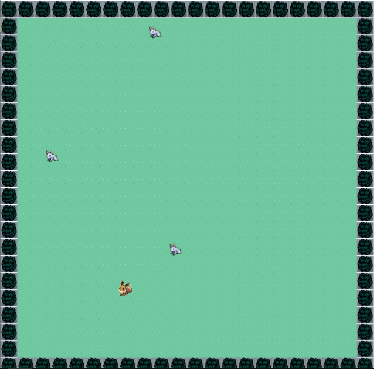
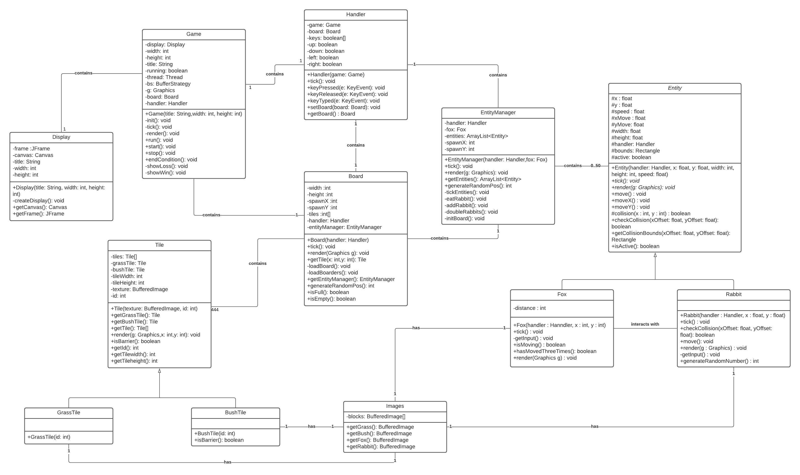

# Fox and Rabbits
 

  

Fox and Rabbits is a 2d game made written in both Java and JavaFX. The player controls the fox and the goal is to consume all the rabbits with the challenge of them multiplying each time the rabbit covers a certain amount of distance.
Once the amount of rabbits on the board has reached a certain threshold the player loses.

# UML Diagram

  

